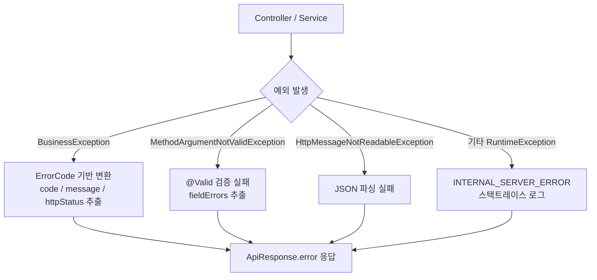
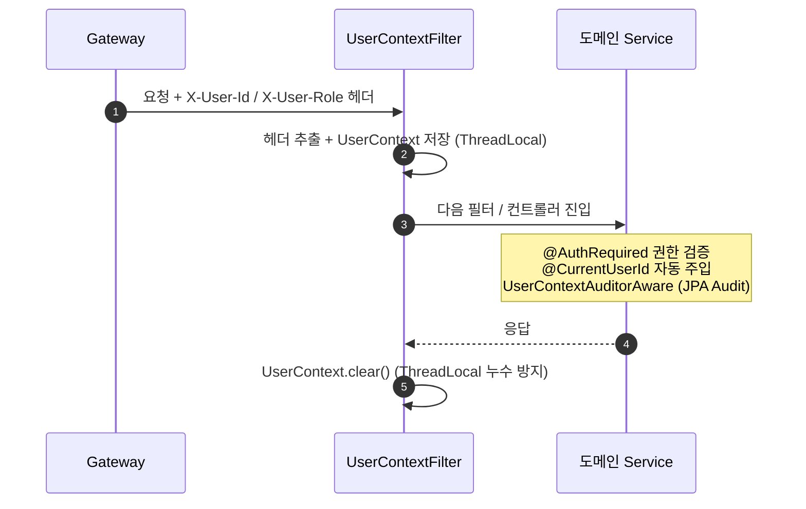

# Pagely — Common

Pagely MSA 의 공유 모듈. 모든 서비스가 의존하는 공통 라이브러리입니다.

## 책임

- 표준 응답 형식 (`ApiResponse`)
- 비즈니스 예외 통합 (`BusinessException` + `GlobalExceptionHandler`)
- 도메인별 ErrorCode 인터페이스
- 인증 컨텍스트 (UserContext, 어노테이션, Resolver, Interceptor)
- JPA Auditing 통합

## 기술 스택

- Java 21
- Spring Boot 3.5.13
- Spring Web / Spring Data JPA

---

## 공통 응답 (ApiResponse)

모든 서비스의 응답을 표준 형식으로 통일.

### 응답 구조

```json
// 성공
{
  "success": true,
  "data": { ... }
}

// 실패
{
  "success": false,
  "error": {
    "code": "USER_NOT_FOUND",
    "message": "유저를 찾을 수 없습니다."
  }
}
```

`@JsonInclude(JsonInclude.Include.NON_NULL)` 적용으로 `data` 또는 `error` 중 하나만 직렬화합니다.

### 사용 예시

```java
// 컨트롤러에서 바로 ResponseEntity 반환
@GetMapping("/{id}")
public ResponseEntity<ApiResponse> findById(@PathVariable UUID id) {
    UserResponse user = userService.findById(id);
    return ApiResponse.ok(user);
}

// 데이터 없는 200 OK
return ApiResponse.ok();

// 201 Created
return ApiResponse.created(user);

// 페이지네이션 응답 (Page<E> → PageResponse 자동 변환)
return ApiResponse.ok(page);

// 페이지네이션 + 매퍼
return ApiResponse.ok(page, UserResponse::from);
```

### 페이지네이션 (`PageResponse`)

Spring Data 의 `Page<T>` 를 응답 친화적 형식으로 변환합니다.

```json
{
  "success": true,
  "data": {
    "content": [ ... ],
    "page": 0,
    "size": 20,
    "totalElements": 145,
    "totalPages": 8,
    "hasNext": true
  }
}
```

---

## 비즈니스 예외 (BusinessException)

도메인 / 비즈니스 로직의 예외를 표현하는 커스텀 예외.

### 사용 패턴

```java
// 기본 — ErrorCode 의 기본 메시지 사용
throw new BusinessException(UserErrorCode.USER_NOT_FOUND);

// 상세 메시지 — 동적 정보 포함
throw new BusinessException(UserErrorCode.INVALID_CREDENTIALS,
        "loginId 또는 password 가 일치하지 않습니다.");

// 원인 예외 포함 — Exception Wrapping
catch (IOException e) {
    throw new BusinessException(CommonErrorCode.INTERNAL_SERVER_ERROR, e);
}
```

`RuntimeException` 을 상속. `throws` 선언 없이 던질 수 있어 도메인 계층의 시그니처 오염 X.

### ErrorCode 인터페이스

```java
public interface ErrorCode {
    String getCode();        // enum name (예: USER_NOT_FOUND)
    String getMessage();
    HttpStatus getHttpStatus();
}
```

각 도메인이 자신의 ErrorCode enum을 정의하고 `ErrorCode` 인터페이스 구현합니다.

```java
@Getter
public enum UserErrorCode implements ErrorCode {

    INVALID_CREDENTIALS("로그인 정보가 올바르지 않습니다.", HttpStatus.UNAUTHORIZED),
    USER_SUSPENDED("계정이 정지된 상태입니다.", HttpStatus.FORBIDDEN),
    USER_NOT_FOUND("유저를 찾을 수 없습니다.", HttpStatus.NOT_FOUND),
    DUPLICATE_LOGIN_ID("이미 사용 중인 로그인 아이디입니다.", HttpStatus.CONFLICT),
    // ...
    ;

    private final String code;
    private final String message;
    private final HttpStatus httpStatus;

    UserErrorCode(String message, HttpStatus httpStatus) {
        this.code = this.name();
        this.message = message;
        this.httpStatus = httpStatus;
    }
}
```

`code` 는 `this.name()` 으로 자동 (별도 코드 번호 X).

---

## GlobalExceptionHandler

### 처리 흐름



### 처리 대상

| 예외 | HTTP Status | 처리 |
| --- | --- | --- |
| `BusinessException` | ErrorCode 의 httpStatus | ErrorCode 기반 변환 |
| `MethodArgumentNotValidException` | 400 | `@Valid` 검증 실패, fieldErrors 추출 |
| `HttpMessageNotReadableException` | 400 | JSON 파싱 실패 |
| `MissingServletRequestParameterException` | 400 | 필수 파라미터 누락 |
| `MethodArgumentTypeMismatchException` | 400 | 파라미터 타입 불일치 |
| `NoHandlerFoundException` | 404 | 매핑되지 않은 endpoint |
| `Exception` (catch-all) | 500 | 예상 못한 예외, 로그 + 알람 |

### 응답 예시

#### BusinessException

```json
HTTP 401
{
  "success": false,
  "error": {
    "code": "INVALID_CREDENTIALS",
    "message": "로그인 정보가 올바르지 않습니다."
  }
}
```

#### 검증 실패 (`@Valid`)

```json
HTTP 400
{
  "success": false,
  "error": {
    "code": "VALIDATION_FAILED",
    "message": "입력값 검증에 실패했습니다.",
    "fieldErrors": [
      { "field": "loginId", "message": "loginId 는 필수입니다." },
      { "field": "password", "message": "비밀번호는 10자 이상 64자 이하여야 합니다." }
    ]
  }
}
```

---

## 인증 컨텍스트 (UserContext)

Pagely 의 도메인 서비스가 사용하는 가벼운 인증 컨텍스트

Spring Security 의 `SecurityContextHolder` 대체. MSA 환경의 단순성 + 명시성 우선을 목표로 개발했습니다.

### 동작 원리



### 구성 요소

| 클래스 / 어노테이션 | 책임 |
| --- | --- |
| `UserContext` | ThreadLocal 의 사용자 정보 (userId, role) |
| `UserContextFilter` | Gateway 의 헤더 → ThreadLocal 저장 + 응답 후 clear |
| `@AuthRequired(role = ...)` | 인증 / 권한 검증의 선언적 적용 (Interceptor) |
| `@CurrentUserId` | 컨트롤러 메서드 파라미터에 userId 자동 주입 (HandlerMethodArgumentResolver) |
| `UserContextAuditorAware` | JPA Auditing 의 `created_by` / `updated_by` 자동 기록 |

### 사용 예시

```java
@AuthRequired(role = MASTER)
@PostMapping("/users/{id}/suspend")
public ResponseEntity<ApiResponse> suspendUser(
        @CurrentUserId UUID currentUserId,
        @PathVariable UUID id
) {
    userService.suspend(id, currentUserId);
    return ApiResponse.ok();
}
```

### 설계 결정

Spring Security 대신 자체 UserContext 채택 트레이드오프:

| | Spring Security | 자체 UserContext (채택) |
| --- | --- | --- |
| 학습 곡선 | 높음 | 낮음 |
| 추상화 | 과한 (Filter Chain 복잡) | 가벼움 (ThreadLocal 단순) |
| MSA 친화성 | 모놀리식 친화 | 헤더 전파 자연스러움 |
| JPA Auditing | 별도 통합 | `AuditorAware` 직접 통합 |

근거:
- MSA 환경에서 인증은 Gateway 중앙 검증 + 헤더 전파로 단순
- 도메인 서비스의 인증 컨텍스트는 가벼울수록 좋음
- Spring Security 의 복잡한 추상화는 본 서비스에 과함

### ThreadLocal 누수 방지

`UserContextFilter` 가 `finally` 블록에서 `UserContext.clear()` 호출. 응답 후 ThreadLocal 정리로 메모리 누수 방지.

---


## 의존 추가

각 서비스의 `build.gradle` 에 추가:

```gradle
repositories {
    mavenCentral()
    maven {
        url = uri("https://maven.pkg.github.com/Pagely-wisely/common")
        credentials {
            username = findProperty("gpr.user")
            password = findProperty("gpr.key")
        }
    }
}
...
dependencies {
    implementation 'com.pagely:common:2.0.3'
}
```

`GlobalExceptionHandler` / `UserContextFilter` 등은 `@ComponentScan` 으로 자동 등록됩니다.
